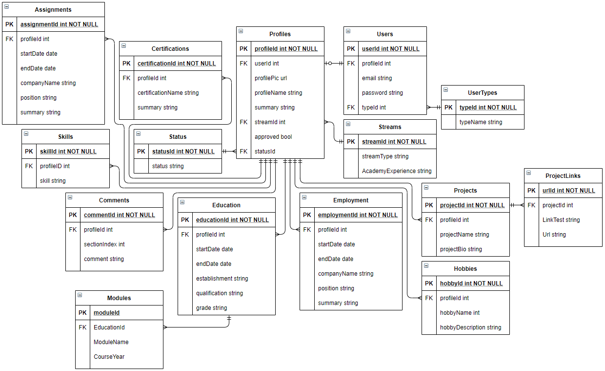

<space><space>

# Sparta Profiles Viewer

- [Sparta Profiles Viewer](#sparta-profiles-viewer)
  - [Project Description](#project-description)
  - [Timeline](#timeline)
  - [Product - Key Details](#product---key-details)
    - [Functional Requirements](#functional-requirements)
    - [Non functional Requirements](#non-functional-requirements)
    - [Types of Users](#types-of-users)
    - [Profile sections](#profile-sections)
    - [Developer environment](#developer-environment)
      - [Backend](#backend)
      - [Frontend](#frontend)
  - [ERD](#erd)
  - [Conclusion](#conclusion)
    - [Description](#description)
    - [Definition of Done - Project](#definition-of-done---project)
    - [Definition of Done - User Stories](#definition-of-done---user-stories)
  - [Sprint Layouts](#sprint-layouts)
    - [Sprint 0 - Planning](#sprint-0---planning)
      - [Overview:](#overview)
      - [Sprint Review:](#sprint-review)
      - [Sprint Retrospective](#sprint-retrospective)
      - [What was done:](#what-was-done)
    - [Sprint 1 - Project setup and MVP](#sprint-1---project-setup-and-mvp)
    - [Sprint 2 - Permissions implementation](#sprint-2---permissions-implementation)
    - [Sprint 3 - Exporting, Admin Panel, Viewing](#sprint-3---exporting-admin-panel-viewing)
    - [Sprint 4 - Clean up](#sprint-4---clean-up)
  - [MVP](#mvp)
    - [MVP Description](#mvp-description)

---

## Project Description

Currently at Sparta Global the resource management team are sending out emails to prospective clients with a PDF attachment of the Spartans they believe would suit the potential client. The issue with this was that, full form PDF documents with Spartan information are too much for clients to read. Worst case scenario, the emails with the PDFs attached do not even get past the potential clients email security. All in all, the efforts of the resource team are wasted.

In order to combat this, the resource management team having been sending out brief PDF documents to clients with just the important details. This has shown an increase in the responses recieved from these email campaigns. Sparta Global would like to continue this, and send out brief PDF documents however there is still the issue of getting past potential clients email security.

Sparta Global would like create a portal system which would display all Spartan profiles. This would be web based which the Resource teams can use to send url links to Spartan profiles as opposed to attaching PDF documents.

---

## Timeline
The proof of concept project has a deadline of 2 weeks to be completed, from planning to a working project.

---

## Product - Key Details

### Functional Requirements
* Display Spartan Profiles
* Filter Spartan Profiles by academy stream

### Non functional Requirements
* The page should be easy to navigate

### Types of Users
* Admin
* Resource manager
* Staff
* Client
* Spartan Student

### Profile sections
* Name
* Summary
* Stream
* Approval Status (Accepted, Needs Edit, ...)
* Job Status (Training, Onsite, ...)
* Education
* Employment
* Projects
* Hobbies

### Developer environment

#### Backend
* Azure database
* ASP .NET core Model and Controller

#### Frontend
* Razor pages View
* JS
* CSS
* HTML

---

## ERD
This Entity Relationship Diagram shows a blueprint of the database used for the project and the relationships between the tables.

---

## Conclusion

### Description

An admin can register other users. If a user is a student can create, view and edit their own profile page. If a user is a resource manager they can approve and disapprove a profile, if is approved their profile is live. If a user is a client, can be registered by admin, can search with a filter and view Sparta profiles and export them.

### Definition of Done - Project

* Completed code uploaded to GitHub and merged into master branch
* README file provides thorough documentation of the application
* Code is concise and clear, following good naming conventions Application encapsulated behind a well designed and easy to use user interface.

### Definition of Done - User Stories
* Code build with no error
* Code review is complete
* Acceptance criteria are met
* The user story is both implemented in Model and GUI
* 80% of unit test passing

---

## Sprint Layouts 

### Sprint 0 - Planning

#### Overview:

* Wednesday 26th - Thursday 27th 
* Scrum Master: **Chen** 
* Task: Project planning and proposing

#### Sprint Review:
* Work getting along well
* Update acceptance criteria into Gherkin syntax
* Add sub tasks to user stories

#### Sprint Retrospective
* Work completed on time
* Follow correct syntax for documentations

#### What was done:

Wednesday 
- 9:30 - 16:00 - Meeting with Emer and initial plans

Thursday
- 9:30 - 11:00 - Created acceptance criteria
- 11:00 - 11:15 - Creating project document
- 11:15 - 11:30 - Break
- 11:30 - 12:20 - Call with Astha and improved acceptance criteria
- 12:20 - 12:30 - Review of call with Astha
- 12:30 - 13:30 - Lunch
- 13:30 - 13:40 - Created Github and added team members as collaborators
- 13:40 - 14:30 - Acceptance criteria updated to follow Gherkin Cucumber syntax

Friday
- 9:30 Academy Stand up
- 9:45 Completed Estimation time
- 10:00 Meeting with Richard:
  - When the ticket is just a 'task' doesn't need to give the Acceptance Criteria with Gherkin syntax
  - The task for the creation of a database can be merged with the first user story
  - Prioritise user stories
  - About Authentication: we can use any given package from C#
- 10:30 Stretched user stories with tasks
- 12:30 Lunch break
- 13:30 Updated the name of the columns of the profile table based on the given template
  - Created a db with "code first" 
    - Created Models
    - Created DBContext
    - Connection string
  - Installed dependencies
- 16:00 Made first migration, checked possible bug and made sure that the project was running for everyone before to leave

Notes: 
- Summary due monday and CV
- Plan revision day
- Make Github
  
---

### Sprint 1 - Project setup and MVP

* Monday
- Bruno worked on index page
- Leo worked on login
- Alex worked on admin panel

* Tuesday
- 9:30 Review of the login, index page admin panel
- 9:45 Merged the work mentioned above into 'dev' branch
- 10:30 Each person planned what to work 
- 11:00 Meeting with Emer
  - Each of us explained our own task for the sprint
  - The 'import' functionality is difficult to be done, maybe we can leave it at the end
  - Planned next meeting for Friday
- 11:20 Leo and Alex worked on encryption and decryption
  - Bruno and Chris worked on permissions
  - Chen worked on showing details of a profile
  - Bryn worked on randomise the password to change after the first login
  - Harry worked on viewing profile page

* Wednesday
- 9:30 Stand up
- 9:45 Merged Leo and Alex encryption/decription
- 10:00 Leo, Bryn and Alex went revision for the QG
  - Bruno, Chris, Chen and Harry worked on the project
- 15:30 Bryn finished the QG
- 16:10 Alex finished the QG
- 16:50 Leo finished the QG

* Thursday
- 9:30 Stand up 
  - Bruno, Chen, Harry and Chris explained what they have done the day before
    - Chris and Bruno worked on permissions, dependig by which user role is logged in redirects to a determined page
    - Chen and Harry worked on format of the profile page to edit
    - Merged 'permissions'
- 10:00 Bruno, Chris and Chen revision for the QG
  - Alex and Leo worked on usertype dropdown list
    - Display user type name instead of an id
  - Harry and Bryn working on styling and template
- 12:30 Lunch break
- 13:30 Chen, Leo, Alex worked on usertype dropdown, and also gives the possibility to display a courses dropdown to select only if the user type is a student
  - Bruno, Chris worked on if user type is an admin or resource manager can approve a profile
  - Harry, Bryn worked on actual content page except Education
- 15:30 Merged: 
  - Display Courses dropdown list if user type is a student
  - Approve profile page from only Admin
  - Profile details
  - Profile creation form
- 17:00 Planning for the next day:
  - Profile view Page
  - Test
  - Polish
  - Index
  - Encryption for random password

* Friday 28th
- 9:30 Academy stand up
- 9:45 Team stand up
  - Chen showing work done overnight, created/edit/delete for each section of the profile
  - Plan for the day: 
    - Test (possible blocker)
    - Azure
    - Index
- 10:00 Meeting with Richard
  - Quality Gate feedback
- 10:40 
  - Each member started to work on:
    - Bryn password
    - Alex Azure Database
    - Chen create page
    - Bruno index
    - Chris helping Bryn
    - Leo test
    - Harry show profile
- 12:30 Lunch breal
- 13:30 back to work
- 15:00 Review and merging all the branches for the Demo with Richard and Emer
- 16:00 Review
  - Demo the web-application
  - Each person explained what he have done
  - Richard questions: 
    - What we wanted to achieve in this sprint
    - UserTypeId -> we still need to polish the pages
    - Register -> as anybody can select a usertype, to avoid that any user can select "admin" as user role, we didn't implement a registration
  - Retro for the Next sprint:
    - Include image of the profile
    - Complete and polish first the tasks of sprint 1 and then start sprint 2
    - Richard can help us for the design to implement in to the front end
    - Image upload -> using AWS bucket

---

### Sprint 2 - Polish and Stretch

* Monday
- 9:30 Stand Up
    
- 10:00
  - Each member started to work on:
    - Chris worked on login tracking and first time login password change
    - Bruno began looking into image uploading and AWS
    - Alex started working on displaying different information within the Admin Panel page and fixing a bug.
    - Leo been looking into exporting to pdf/docx
- 12:30 Lunch

- 13:30
  - Back to work
  - Bruno begun work on uploading an image
- 16:00 Daily review and merge
  
* Tuesday
- 9:30 Stand Up
  - People talked about overnight work
    - Leo been looking into exporting to pdf/docx, unfortunately not much progress
    - Bruno been working on uploading to AWS
- 10:00 Azure integration
  - Connecting our project to the Azure database that Alex set up last friday

- 12:30 Lunch

- 13:30
  - Bruno continued working on AWS and save url image paths, bug fixes for Edit profile
  
- 16:00 Daily review and merge
  - Made decision to put export functionality on the back burner for the time being as it has been consuming a lot of time and effort from the team which could be better utilised on other user stories.
  - Leo can export a Word file, but having a blocker to export a Power Point file
* Wednesday
- 9:30 Stand up
- 10:00 
  - Leo working on styling login page
  - Chris working on automated email system
  - Bruno worked on video uploads
- 12:30 Lunch
- 13:30 

  - Chris assisted Bryn with Password validification, and worked on fixes for the admin panel
  - Alex added styling to the Admin Panel page and updated a user's name within.
  - Bruno implemented youtube/streams uploads
- 16:30 
  

* Thursday
- 9:30 Stand up
- 10:00 
  - Chris Refactored Sessions, user deletion
  - Chen added permissions to all profile sections and merged into Dev branch
  - Bruno worked on bug hunting
- 11:00
  - Chen added styles to all the profile sections
- 12:30 Lunch
- 13:30 
  - Chris added first time user password change
- 14:00
  - Chen fixed a permissions issue
  - Bruno helped with Bryn and leo
- 15:00
  - Final Merge of all branches

* Friday
- PRESENTATION

## MVP
### MVP Description
* Creating a page with input boxes to create a online Sparta Profile and view all the profiles based on the layout given by product owner
